---
## Front matter
title: "Отчёт по лабораторной работе 2"
subtitle: "Архитектура компьютера"
author: "Лисенкова Екатерина Павловна"

## Generic otions
lang: ru-RU
toc-title: "Содержание"

## Bibliography
bibliography: bib/cite.bib
csl: pandoc/csl/gost-r-7-0-5-2008-numeric.csl

## Pdf output format
toc: true # Table of contents
toc-depth: 2
lof: true # List of figures
lot: true # List of tables
fontsize: 12pt
linestretch: 1.5
papersize: a4
documentclass: scrreprt
## I18n polyglossia
polyglossia-lang:
  name: russian
  options:
	- spelling=modern
	- babelshorthands=true
polyglossia-otherlangs:
  name: english
## I18n babel
babel-lang: russian
babel-otherlangs: english
## Fonts
mainfont: PT Serif
romanfont: PT Serif
sansfont: PT Sans
monofont: PT Mono
mainfontoptions: Ligatures=TeX
romanfontoptions: Ligatures=TeX
sansfontoptions: Ligatures=TeX,Scale=MatchLowercase
monofontoptions: Scale=MatchLowercase,Scale=0.9
## Biblatex
biblatex: true
biblio-style: "gost-numeric"
biblatexoptions:
  - parentracker=true
  - backend=biber
  - hyperref=auto
  - language=auto
  - autolang=other*
  - citestyle=gost-numeric
## Pandoc-crossref LaTeX customization
figureTitle: "Рис."
tableTitle: "Таблица"
listingTitle: "Листинг"
lofTitle: "Список иллюстраций"
lotTitle: "Список таблиц"
lolTitle: "Листинги"
## Misc options
indent: true
header-includes:
  - \usepackage{indentfirst}
  - \usepackage{float} # keep figures where there are in the text
  - \floatplacement{figure}{H} # keep figures where there are in the text
---

# Цель работы

Изучение идеологии и применеие средств контроля версий. приобретение практических навыков по работе с системой git.

# Задание

. Создайте отчет по выполнению лабораторной работы в соответствующем каталоге
рабочего пространства (labs>lab02>report).
2. Скопируйте отчеты по выполнению предыдущих лабораторных работ в соответствую-
щие каталоги созданного рабочего пространства.
3. Загрузите файлы на github.

# Теоретическое введение

Здесь описываются теоретические аспекты, связанные с выполнением работы.

Например, в табл. @tbl:std-dir приведено краткое описание стандартных каталогов Unix.

: Описание некоторых каталогов файловой системы GNU Linux {#tbl:std-dir}

| Имя каталога | Описание каталога                                                                                                          |
|--------------|----------------------------------------------------------------------------------------------------------------------------|
| `/`          | Корневая директория, содержащая всю файловую                                                                               |
| `/bin `      | Основные системные утилиты, необходимые как в однопользовательском режиме, так и при обычной работе всем пользователям     |
| `/etc`       | Общесистемные конфигурационные файлы и файлы конфигурации установленных программ                                           |
| `/home`      | Содержит домашние директории пользователей, которые, в свою очередь, содержат персональные настройки и данные пользователя |
| `/media`     | Точки монтирования для сменных носителей                                                                                   |
| `/root`      | Домашняя директория пользователя  `root`                                                                                   |
| `/tmp`       | Временные файлы                                                                                                            |
| `/usr`       | Вторичная иерархия для данных пользователя                                                                                 |

Более подробно об Unix см. в [@gnu-doc:bash;@newham:2005:bash;@zarrelli:2017:bash;@robbins:2013:bash;@tannenbaum:arch-pc:ru;@tannenbaum:modern-os:ru].

# Выполнение лабораторной работы

Создала учётную запись на сайте github(рис. @fig:001).

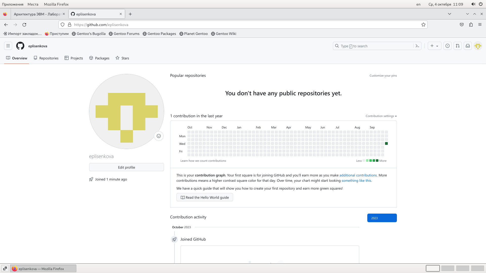{#fig:001 width=70%}

Базовая настройка github. Указала имя и email владельца репозитория.(рис. @fig:002).

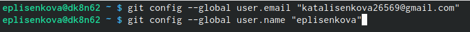{#fig:002 width=70%}

Настроила utf-8 в выводе сообщений git.(рис. @fig:003).

{#fig:003 width=70%}

Задала имя начальной ветки.(рис. @fig:004).

{#fig:004 width=70%}

Настроила параметры autocrlf и safecrlf.(рис. @fig:005).

{#fig:005 width=70%}

Создание SHH ключа. Сгенерировала пару ключей.(приватный и открытый).(рис. @fig:006).

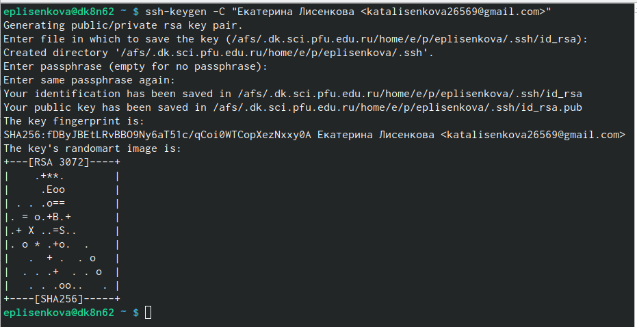{#fig:006 width=70%}

Загрузила открытый ключ, скопировав из локальной консоли ключ в буфер обмена.Вставила ключ в поле на сайте, указав имя ключа.(рис. @fig:007).

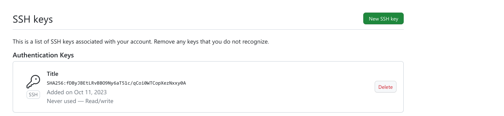{#fig:007 width=70%}

Создание рабочего пространства и репозитория курса. Создала каталог для предмета "Архитектура компьютера".(рис. @fig:008).

{#fig:008 width=70%}

Перешла в каталог курса и клонировала созданный репозиторий.(рис. @fig:009).

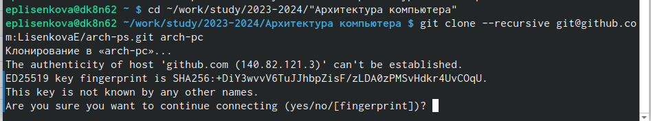{#fig:009 width=70%}

Настройка каталога курса. Удалила лишние файлы и создала необходимые каталоги.(рис. @fig:010).

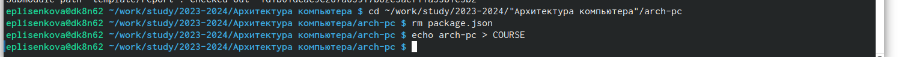{#fig:010 width=70%}

Отправила файлы на сервер.(рис. @fig:011).

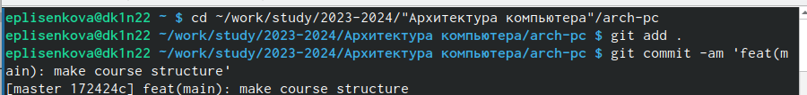{#fig:011 width=70%}

Подтверждение отправки файлов.(рис. @fig:012).

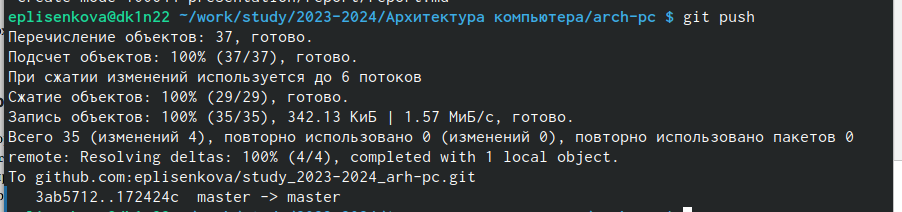{#fig:012 width=70%}

Проверила правильность создания иерархии рабочего пространства в локальном репозитории.(рис. @fig:013).

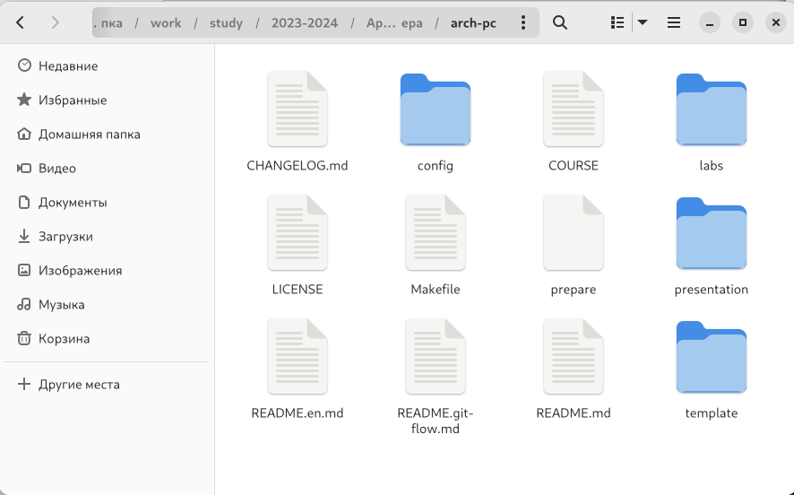{#fig:013 width=70%}

Проверила правильность создания иерархии рабочего пространства на странице github.(рис. @fig:014).

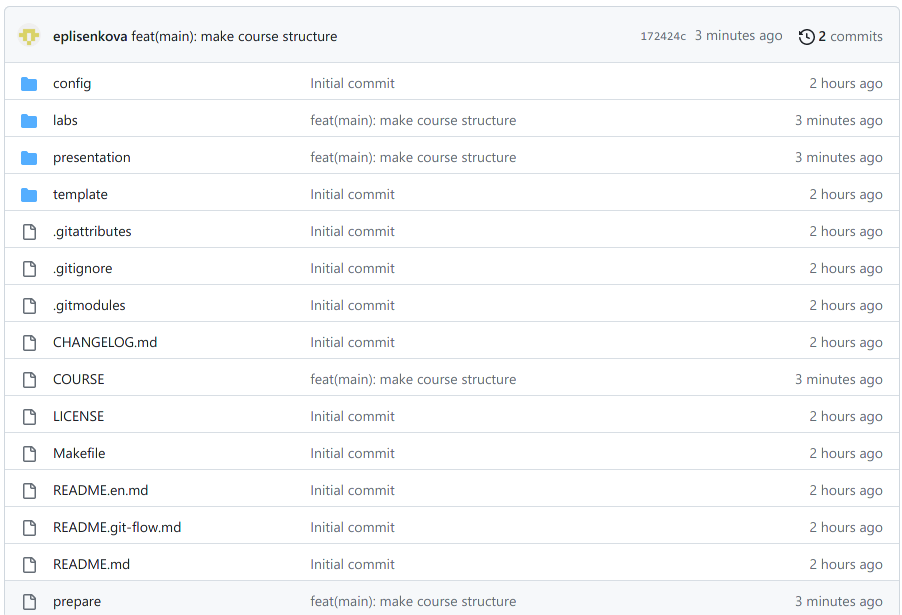{#fig:014 width=70%}

Самостоятельная работа.Создала отчёт о выполнении второй лабораторной работы в соответствующем каталоге рабочего пространства.(рис. @fig:015).

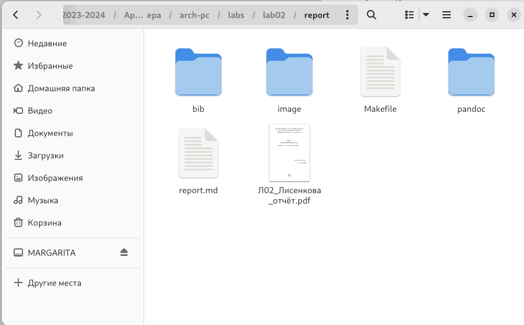{#fig:015 width=70%}

Скопировала отчёты предыущих лабораторных работ.(рис. @fig:016).

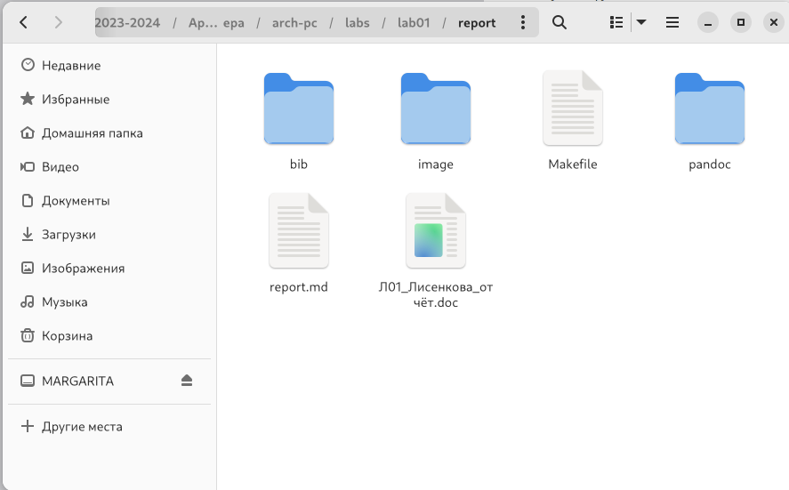{#fig:016 width=70%}

Загрузила файлы на github.(рис. @fig:017).

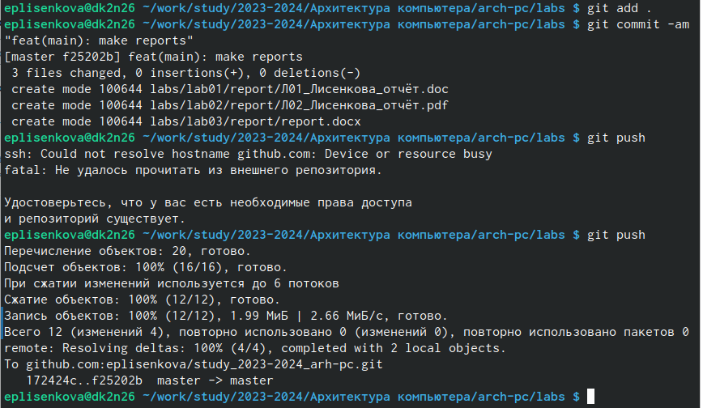{#fig:017 width=70%}

Проверила наличие файлов на github.(рис. @fig:017).

{#fig:017 width=70%}

# Выводы

В ходе лабораторной работы я изучила идеологию и применение средств контроля версий.
Приобрела практические навыки по работе с системой git.

# Список литературы{.unnumbered}

::: {#refs}
:::
